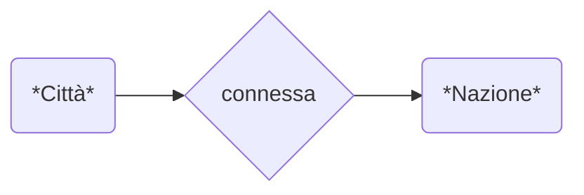
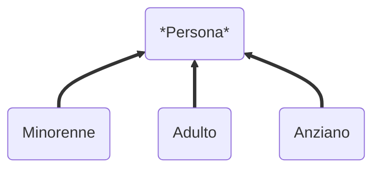

<!--
# EntityRelationship

### Entità
> Un tipo di dato (tipo una struct)
> - Contiene almeno 1 chiave (ovvero un identificatore univoco per la classe)

### Relazione
> Una connessione che permette la concatenazione fra 2 entità.
-->

## Ciclo di vita

A noi interessa nel corso **Analisi** e **Progettazione**

## Progettazione di basi di dati
>- Schema concettuale
>   - ER 
>- Schema logico (ad esempio schema relazionale)
>   - Relazionale, xml, nosql ...  
>- Schema fisico

# ER
### Entità
>  - Classe di oggetti (fatti, persone, cose) della realtà di interesse 
### Relationship
>  - Legame logico fra due o più entità, rilevante nell’applicazione di interesse
>  - Alcune relazioni potrebbero essere convenienti come entità.
>  - Relazioni ricorsive con la stessa entità.
### Attributo
>  - Proprietà elementare di un’entità o di una relationship, di interesse ai fini dell’applicazione.
>  - Attributi composti

### Cardinalità
>  - di relationship
>  - di attributo

>Basta rispondere a questa domanda:
>
>***"A quanti B può avere/essere/...?" e "B quanti A può avere/essere/...?"***

> `Esempio:` "Una città a quanti nazioni può essere connessa?" 1 e 1 solamente. (1,1)
> 
> `Esempio:` "Una nazione a quante città può essere connessa?" molte percio da 0 a N. (0,N)

### Identificatore
> interno
>  - chiave primaria e o secondarie.
>  
> esterno
>  - chiavi che necessita di una ralazione.
### Generalizzazione
Le varie specializzazioni. (Ereditarietà)
> **totale** se ogni occorrenza dell'entità genitore è occorrenza di almeno una delle entità figlie, altrimenti è parziale
>
> **esclusiva** se ogni occorrenza dell'entità genitore è occorrenza di al più una delle entità figlie, altrimenti è sovrapposta
>
> Notare differenza nella linea piu marcata/riempita nel disegnare.

***
Vedere tipi di esercizzi:
- [x]  Creare un ER
- [x] Modificare l'ER del esercizio precedente
- [ ] Progettazione logica
- [ ] Ridondanza
- [x] Tabella Si/No basata su domande su dei ER
- [x] Tabella stile excell dove fai esempi in base a modelli leggermente differenti di ER
