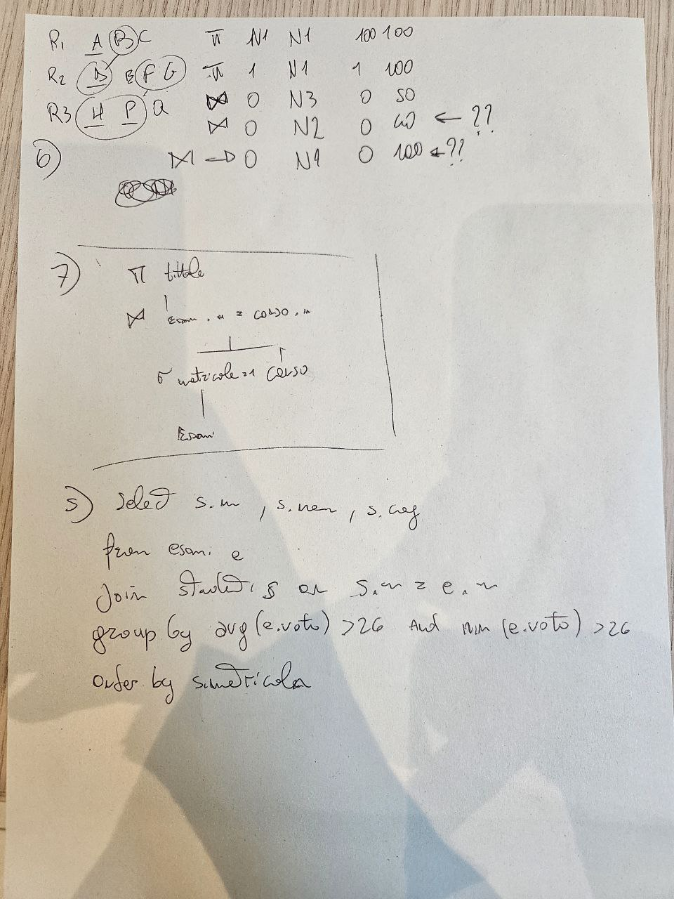
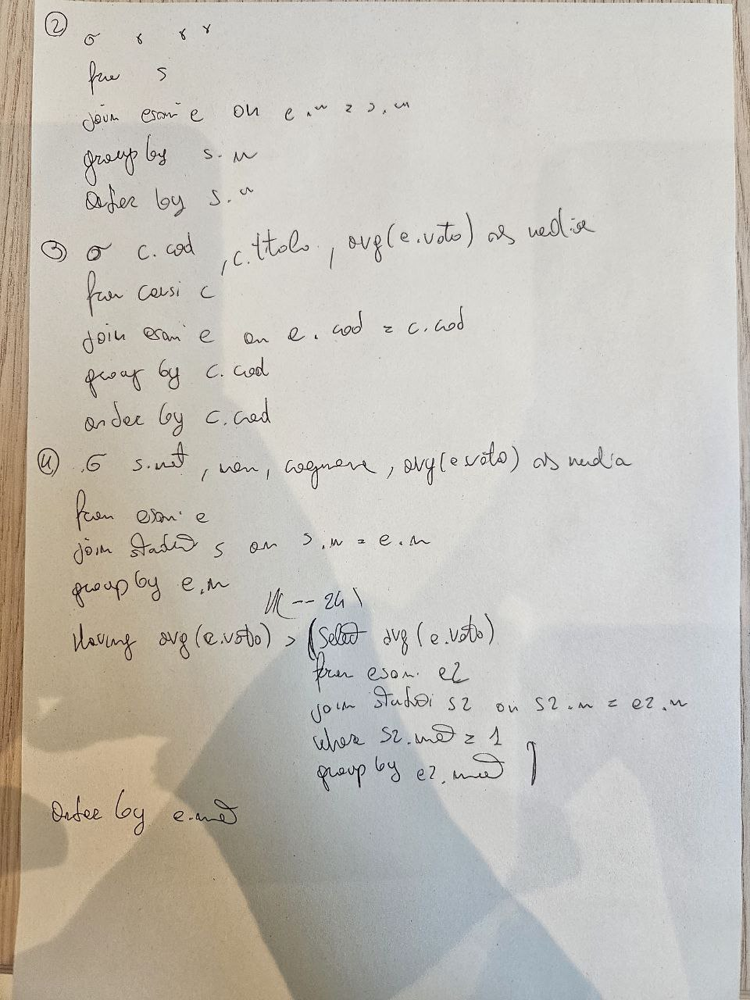
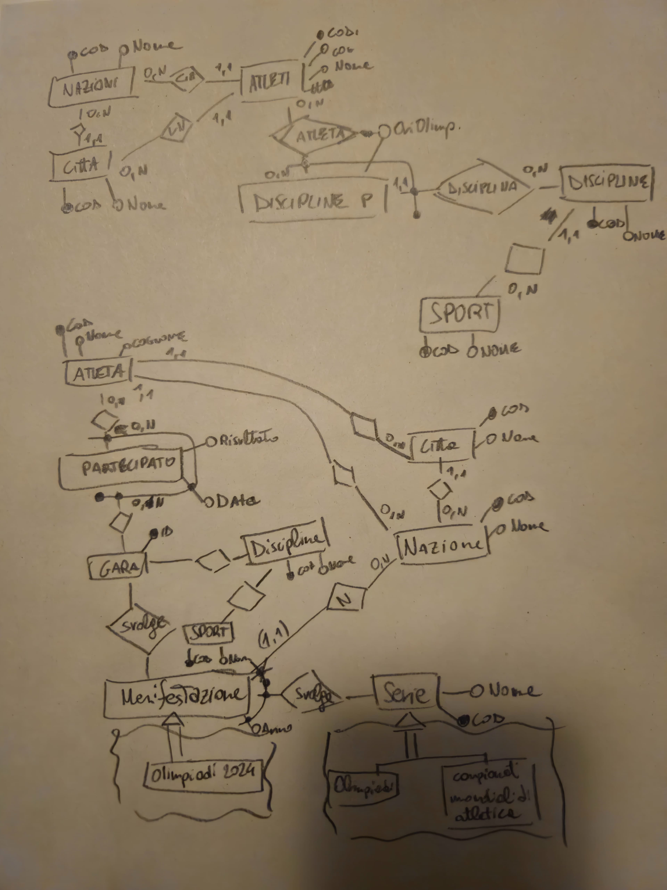

# Basi-di-dati

- [DDL-Data Defintion Language](./DDL.md)
- [DML-Data Manipulation Language](./DML.md)
  - [Algebra relazionale](./Algebra-Relazionale.md)

<h4>Esonero 1 - (DML) Query</h2>

 Soluzioni Foto 1

  

 Soluzioni Foto 2

<h4>Esonero 2 - (ER) Progettazione logica</h2>

 Foto Soluzione (C)

